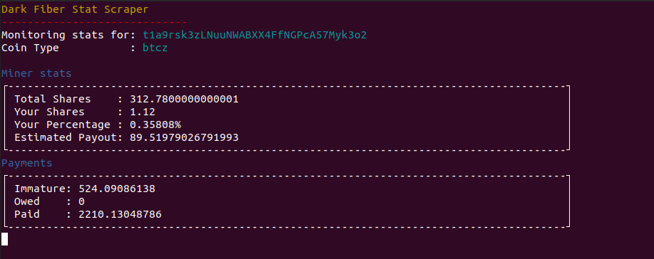

# DarkFiberStats

Part sys-admin, part crypto nerd stuff, _all_ awesome. A companion terminal app that gives the same stats as the main [Aggro-Gator](https://aggrogator.dev/) site

## README WILL BE FLESHED OUT MORE AS FEATURES ARE DEVELOPED :)

## Why?

Sometimes you don't want to pop open _another_ web browser or tab, when all you want is information. This solves the issue of having to pull up a web browser to monitor your Dark Fiber stats when you might not even have a web browser on the miner you're looking at!

## What?

Like I mentioned before, it's a terminal app that shows you your current mining stats, potential payouts, and shares submitted, as well as immature balances (from pending blocks), owed coins, and actually-paid-out coins. It's more or less like `htop`, except it puts all of your stats right in the same tty/ssh instance as your mining software.

## Who?

It's made for fans of Dark Fiber/members of the conspiracy, as it will only pull from my other project's API (which in turn _only_ scrapes Dark Fiber at the time of writing). You're welcome to fork this repo and adapt it to suit your own scaper API, but I'm likely not going to help you do that ;)

## How?

Simple. Wait for the initial release, then grab the zip files I'll be providing. I'll include `.sh` and `.bat` files for every supported coin, and all you'll have to do is run it (after inspecting it like a safe miner of course).

In other words... TODO!

## Support?

If you like this project, consider supporting development by either:

1. Adding support for more coins/more stats/maybe more mining sources
2. Supporting the developer to do it for you ;)

## Wallets?

If you fall more in line with option #2, I appreciate the interest :)

- RVN: `RVn2WxQdnMZw5SR31ehUHPLDMDrG3bhPV9`
- DOGE: `DFBQjyivrpmeCPJoP26PRhGX4FLJQEGALJ`
- BTCZ: `t1a9rsk3zLNuuNWABXX4FfNGPcA57Myk3o2`
